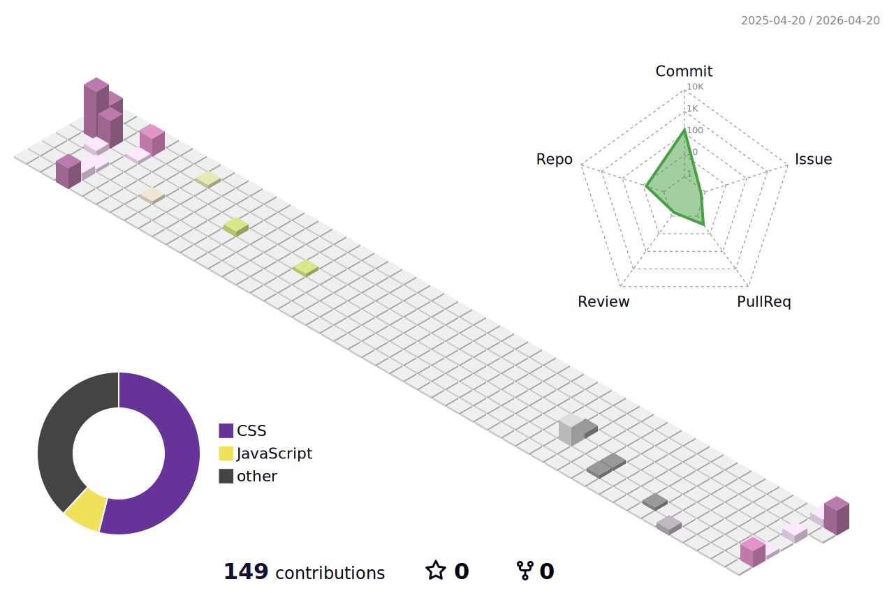

# Olá, eu sou o Erick!

  Desenvolvedor por ocasião, comprometido a criar soluções modernas, funcionais e com propósito para áreas de negócios.  
 Tenho focado meus estudos em <strong>Node.js</strong> e <strong>React</strong>, com o objetivo de transformar cada aprendizado em projetos reais ao longo da minha jornada.

## Sobre mim

- 🖥️ Técnico em Mecatrônica.
- 🎓 Graduando em Engenharia de Automação e Controle.
- 🎓 Graduando em Big Data e Inteligência Analítica.
- 📚 Estudando JavaScript, Node.js, React e desenvolvimento fullstack para aplicações de Business Intelligence as áreas de negócios.
- 🌍 Explorando novas tecnologias e desenvolvendo soluções de software.

---

  
  

  
 |  |  |  
 | ----------- | ----------- |

 
  

<a href="https://erickgods.github.io/GitFolio_v2/"   >
  
   

  

 
##
   

     
  

  

     <a href="https://erickgods.github.io/GitFolio_v2/"/>
  

 

 
  
  

  

