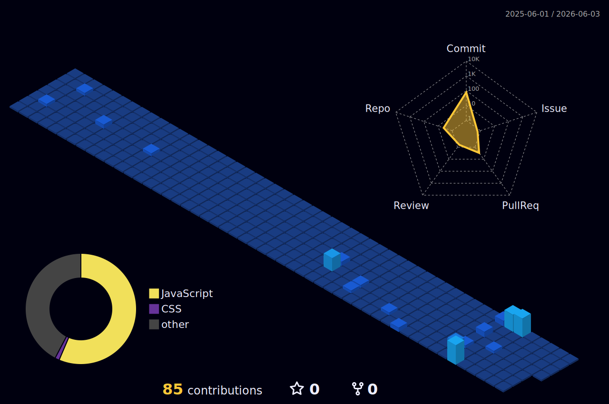

# Erick Dias · ErickGods

**Data Engineer in the making · QA Analyst @ Hyundai Motor Brazil · Builder of things with purpose**

---

## Quem sou eu

Sou Engenheiro de Automação (em formação) com atuação em **Quality Assurance e Engenharia de Dados na Hyundai Motor Brasil**. No dia a dia, construo pipelines de dados, desenvolvo automações com Power Platform e analiso indicadores de qualidade de campo para uma das maiores montadoras do mundo.

Paralelamente, estou em transição ativa para a área de **Data Engineering** — estudando Python, SQL, PySpark e arquitetura de dados em nuvem, com projetos reais que testam o que aprendo.

Fora do trabalho, desenvolvo o **Vault Inc.**, uma plataforma multi-agente com IA que simula uma empresa de tecnologia completa, usando LLMs, MCPs e pipelines automatizados.

---

## Stack atual

**Dados & Automação**

**Engenharia & Infra**

**Desenvolvimento**

**Produtividade & PKM**

---

## O que estou construindo

### 🏗️ Vault Inc. — Multi-Agent AI Company
> Empresa de tecnologia simulada com agentes de IA especializados

Uma plataforma multi-agente onde cada "funcionário" é um LLM com contexto, memória e responsabilidades definidas. Arquitetura com 4 domínios (Produto, Engenharia, Segurança e Dados/IA), ~10 agentes e um fluxo padronizado de intake de projetos via PM.

Stack: **Claude · MCPs · Python · VSCode · Obsidian**

---

### 📊 Em exploração ativa
- Pipelines ETL/ELT com Python e PySpark
- Arquitetura de dados moderna: Data Lakehouse, Delta Lake, Medallion Architecture
- Orquestração com Apache Airflow e Azure Data Factory
- CI/CD aplicado a engenharia de dados (GitHub Actions)

---

## Formação

| Curso | Instituição | Status |
|-------|------------|--------|
| Engenharia de Automação e Controle | UNISAL | Em andamento — 2022–2026 |
| Big Data e Inteligência Analítica | PUC Paraná | Em andamento — 2025–2026 |
| Técnico em Mecatrônica | UNISAL Americana | Concluído — 2021 |

---

## GitHub Stats

|  |  |
|---|---|

---

## Onde me encontrar

Construindo, errando e aprendendo — um pipeline de cada vez.

